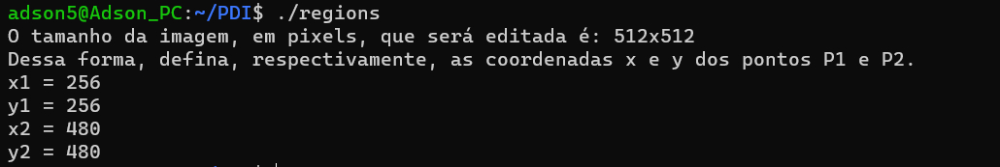
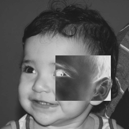
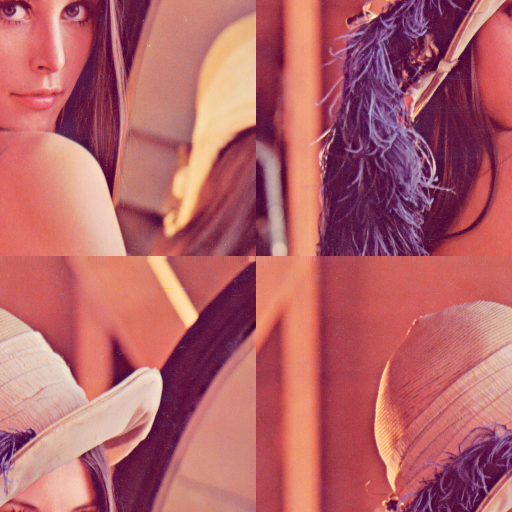
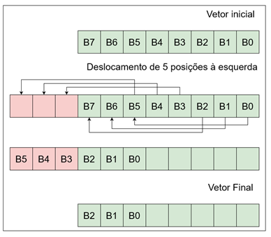
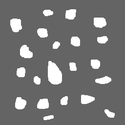
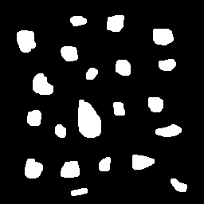
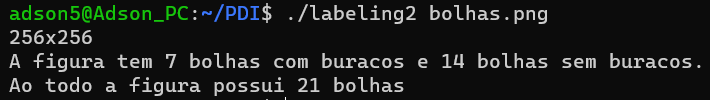
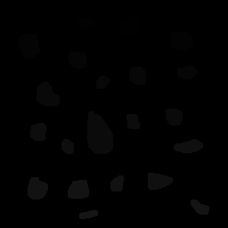

= Página Pessoal - Adson Emanuel
Processamento Digital de Imagens (DCA0445)
:toc: left
:toc-title: Sumário
:doctype: book

== Prefácio

[.text-justify]
Esse site contém a resolução dos exercícios que foram propostos na disciplina Processamento Digital de Imagens ofertada pelo Departamento de Engenharia de Computação e Automação da UFRN e ministrada pelo professor Agostinho Brito. As informações acerca da disciplina podem ser vista em: https://agostinhobritojr.github.io/tutorial/pdi/.

[.text-justify]
Os exercícios foram desenvolvidos em C++, sendo necessário ter a biblioteca OpenCV https://opencv.org/. As regras de compilação dos códigos estão definidos no arquivo Makefile que está presente no site do curso. Dessa forma, para compilar e executar os códigos utiliza-se os seguintes comandos:

[source,SHELL]
----
$ make <nome_arquivo>
$ ./<nome_arquivo> <nome_da_imagem_ou_video>
----

= Parte I: Processamento de Imagens no Domínio Espacial

== 1. Manipulando Pixels em uma Imagem

=== 1.1. Negativo numa região

[.text-justify]
O primeiro programa implementado chama-se <<regions,regions.cpp>>. Ele solicita ao usuário as coordenadas de dois pontos, P1 e P2, localizados dentro dos limites do tamanho da imagem e usa-os como vértices opostos na criação de um retângulo. A região triangular criada é exibida com o negativo da imagem no local correspondente.

[#regions]
.regioes.cpp
[source, CPP]
----
#include <iostream>
#include <opencv2/opencv.hpp>

int main(int, char**){
  cv::Mat image;
  cv::Vec3b val;

  image= cv::imread("biel.png",cv::IMREAD_COLOR);
  if(!image.data)
    std::cout << "A imagem não foi aberta" << std::endl;
  
  int cols, rows, x1, x2, y1 ,y2;
  
  cols = image.cols;
  rows = image.rows;

  std::cout << "O tamanho da imagem, em pixels, que será editada é: " << cols << "x" << rows << std::endl;

  while (true){
    std::cout << "Dessa forma, defina, respectivamente, as coordenadas x e y dos pontos P1 e P2." << std::endl;
	std::cout << "x1 = ";
	std::cin >> x1;
	std::cout << "y1 = ";
	std::cin >> y1;
	

    if (x1 < 0 || x1 >= cols || y1 < 0 || y1 >= rows) {
      std::cout << "Pelo menos um dos pontos está fora dos limites da imagem." << std::endl;
    } else {
      std::cout << "x2 = ";
      std::cin >> x2;
      std::cout << "y2 = ";
      std::cin >> y2;

      // Verifique se os pontos formam um retângulo válido
      if (x2 < 0 || x2 >= cols || y2 < 0 || y2 >= rows || x1 >= x2 || y1 >= y2) {
        std::cout << "Os pontos não formam um retângulo válido." << std::endl;
      } else {
        break;  // As coordenadas são válidas, saia do loop
      }
    }  
  }
  
  cv::namedWindow("janela", cv::WINDOW_AUTOSIZE);

  for(int i=x1;i<x2;i++){
    for(int j=y1;j<y2;j++){
	  val = image.at<cv::Vec3b>(i,j);

      val[0] = 255 - val[0];
      val[1] = 255 - val[1];
      val[2] = 255 - val[2];
      image.at<cv::Vec3b>(i,j)= val;
    }
  }
  
  cv::imshow("janela", image);  
  cv::waitKey();
  
  cv::imwrite("biel_negativo.png", image);
  
  return 0;
}
----

[.text-justify]
Num primeiro momento se faz importante observar a presença de trechos de códigos que estão na implemntação acima e serão usados em diversas outras implementações. São eles: leitura e verificação, onde a imagem é aberta e se verifica se há algum erro com ela; criação e fechamento da janela onde a imagem será exibida; e o trecho que salva a nova imagem na memória.

.Leitura e Verificação
[source, CPP]
----
image= cv::imread("biel.png",cv::IMREAD_COLOR);
if(!image.data)
  std::cout << "A imagem não foi aberta" << std::endl;
----

.Criação e fechamento da Janela de Visualização
[source, CPP]
----
cv::namedWindow("janela", cv::WINDOW_AUTOSIZE);

cv::imshow("janela", image);  
cv::waitKey();
----

.Salvando nova imagem
[source, CPP]
----
cv::imwrite("lena_negativo.png", image);
----

[.text-justify]
Tratando agora do restante da implementação, os pontos máximos de largura e altura da imagem são obtidos e printados, para que o usuário saiba quais os limites ele deve respeitar ao inserir os pontos. Após isso, os vértices do retângulo onde será aplicado o negativo são solicitados ao usuário. Caso ele forneça pontos que estejam fora dos limites da imagem ou que não formem um retângulo válido o programa solicita que ele forneça novos pontos.

[source, CPP]
----
int cols, rows, x1, x2, y1 ,y2;
  
cols = image.cols;
rows = image.rows;

std::cout << "O tamanho da imagem, em pixels, que será editada é: " << cols << "x" << rows << std::endl;

while (true){
  std::cout << "Dessa forma, defina, respectivamente, as coordenadas x e y dos pontos P1 e P2." << std::endl;
  std::cout << "x1 = ";
  std::cin >> x1;
  std::cout << "y1 = ";
  std::cin >> y1;
	
  // Verifique se os pontos estão dentro dos limites da imagem
  if (x1 < 0 || x1 >= cols || y1 < 0 || y1 >= rows) {
    std::cout << "Pelo menos um dos pontos está fora dos limites da imagem." << std::endl;
  } else {
    std::cout << "x2 = ";
    std::cin >> x2;
    std::cout << "y2 = ";
    std::cin >> y2;

    // Verifique se os pontos formam um retângulo válido
    if (x2 < 0 || x2 >= cols || y2 < 0 || y2 >= rows || x1 >= x2 || y1 >= y2) {
      std::cout << "Os pontos não formam um retângulo válido." << std::endl;
    } else {
      break;  // As coordenadas são válidas, saia do loop
    }
  }  
}
----

[.text-justify]
Em seguida, percorre-se o espaço do retângulo e atribui-se a vairável val as cores do pixel que está na posição atual. De posse dessa informação, o efeito negativo é aplicado ao subtrair cada valor de canal de cor do valor máximo possível (255). Por fim, os novos valores de cada canal de cor são atualizados. 

[source, CPP]
----
for(int i=x1;i<x2;i++){
    for(int j=y1;j<y2;j++){
	  val = image.at<cv::Vec3b>(i,j);

      val[0] = 255 - val[0];
      val[1] = 255 - val[1];
      val[2] = 255 - val[2];
      image.at<cv::Vec3b>(i,j)= val;
    }
  }
----

[.text-justify]
Um exemplo de execução do programa pode ser visto a seguir.

[terminal_regions.png]
.Terminal: regions.cpp

[#biel.png]
.Entrada - biel.png
image::PDI/1/biel.png[Lena, 256, 256]

[#biel_negativo.png]
.Saída - biel_negativo.png

=== 1.2. Trocando regiões

[.text-justify]
O programa <<trocaregioes,trocaregioes.cpp>> troca os quadrantes em diagonal na imagem.

[#trocaregioes]
.trocaregioes.cpp
[source, CPP]
----
#include <iostream>
#include <opencv2/opencv.hpp>

int main(int, char**){
  cv::Mat image;
  cv::Vec3b aux;
  
  image= cv::imread("Lena.png",cv::IMREAD_COLOR);
  if(!image.data)
    std::cout << "nao abriu imagem.png" << std::endl;

  cv::namedWindow("janela", cv::WINDOW_AUTOSIZE);

  for (int i = 0; i < image.rows/2; i++) {
    for (int j = 0; j < image.cols/2; j++) {
      aux = image.at<cv::Vec3b>(i,j);
      image.at<cv::Vec3b>(i,j) = image.at<cv::Vec3b>(i+image.rows/2,j+image.cols/2);
      image.at<cv::Vec3b>(i+image.rows/2,j+image.cols/2) = aux;

      aux = image.at<cv::Vec3b>(i+image.rows/2,j);
      image.at<cv::Vec3b>(i+image.rows/2,j) = image.at<cv::Vec3b>(i,j+image.cols/2);
      image.at<cv::Vec3b>(i,j+image.cols/2) = aux;
	}
  }
  
  cv::imshow("janela", image);  
  cv::waitKey();
  
  cv::imwrite("Lena_trocaregioes.png", image);
  
  return 0;
}
----

[.text-justify]
A troca das regiões da imagem foi feita a partir do aninhamento de dois laços for que irão percorrer metade das linhas e metade das colunas da imagem. 

[.text-justify]
Dentro dos for’s, pode-se dizer que existem dois blocos de códigos, onde ambos fazem o uso da vairável auxilair trono. Num primeiro momento, a varíavel trono guarda as características do pixel do primeiro quadrante, esse pixel é substituído pelo pixel do quarto quadrante ao se acessar a posição (i+image.rows/2,j+image.cols/2) e então o pixel do quarto quadrante é atualizado ao receber o trono. 

[.text-justify]
Esse mesmo procedimento se repete no segundo bloco de código, mas dessa vez  o trono é utilizado para fazer a troca entre os elementos do segundo quadrante, acessados na posição (i,j+image.cols/2)  e do terceiro quadrante, acessados na posição (i+image.rows/2,j). 

[.text-justify]
Assim, ao fim das iterações do laço, as regiões são trocadas, como é possível averiguar na  <<imagem,Lena_trocaregioes.png>>

[#Lena_trocaregioes.png]
.Saída - Lena_trocaregioes.png

== 2. Decomposição de imagens em planos de bits

=== 2.1 Desafio Esteganografia

[.text-justify]
O programa <<recupera_imagem,recupera_imagem.cpp>> recupera a imagem codificada de uma imagem resultante de esteganografia.

[#recupera_imagem]
.recupera_imagem.cpp
[source, CPP]
----
#include <iostream>
#include <opencv2/opencv.hpp>

int main(int argc, char**argv) {
  cv::Mat imagemEscondida, imagemFinal;
  cv::Vec3b valEscondida, valFinal;
  int nbits = 5;

  imagemFinal = cv::imread(argv[1], cv::IMREAD_COLOR);
  
   if (imagemFinal.empty()) {
    std::cout << "imagem nao carregou corretamente" << std::endl;
    return (-1);
  }

  const char* arg2 = argv[2];
  std::string nome_imagem = arg2;
  nome_imagem += ".png";
  
  imagemEscondida = imagemFinal.clone();
  
  for (int i = 0; i < imagemFinal.rows; i++) {
    for (int j = 0; j < imagemFinal.cols; j++) {

	  valFinal = imagemFinal.at<cv::Vec3b>(i, j);
	  
      valEscondida[0] = valFinal[0] << nbits;
      valEscondida[1] = valFinal[1] << nbits;
      valEscondida[2] = valFinal[2] << nbits;
	  
      imagemEscondida.at<cv::Vec3b>(i, j) = valEscondida;
	  
    }
  }

  imwrite(nome_imagem, imagemEscondida);

  return 0;
}
----

[.text-justify]
Neste código, a imagem que será processada tem seu nome digitado pelo usuário durante a chamada do programa. Então, ela tem seu nome resgatado, é aberta e  tem sua integridade testada a partir do código a seguir:

[source, CPP]
----
imagemFinal = cv::imread(argv[1], cv::IMREAD_COLOR);

if (imagemFinal.empty()) {
  std::cout << "imagem nao carregou corretamente" << std::endl;
  return (-1);
}
----

[.text-justify]
Logo após, é feito um tratamento para receber o nome da imagem escondida a partir da imagem esteganografada. Tal nome é passado pelo usuário pela linha de comando.
[source, CPP]
----
const char* arg2 = argv[2];
std::string nome_imagem = arg2;
nome_imagem += ".png";
----

[.text-justify]
Em seguida o objeto da clase Mat imagemFinal é clonado e atribuido ao objeto  imagemEscondida. Isso é feito pois, mesmo que o conteúdo da imagem vá mudar, alguns outros atributos precisam ser herdado, como, por exemplo, o tamanho e tipo.
[source, CPP]
----
imagemEscondida = imagemFinal.clone();
----

[.text-justify]
O par de for aninhados é utilizado para percorrer as linhas e colunas da imagem Final. 

[source, CPP]
----
for (int i = 0; i < imagemFinal.rows; i++) {
  for (int j = 0; j < imagemFinal.cols; j++) {
    valFinal = imagemFinal.at<cv::Vec3b>(i, j);
	  
    valEscondida[0] = valFinal[0] << nbits;
    valEscondida[1] = valFinal[1] << nbits;
    valEscondida[2] = valFinal[2] << nbits;
	  
    imagemEscondida.at<cv::Vec3b>(i, j) = valEscondida;
	  
  }
}
----

[.text-justify]
Dentro desses for’s, a vairável valFinal guarda as informações do pixels referentes a imagem Final.

[.text-justify]
No trecho seguinte, os nbits menos significativos de ValFinal são deslocados à esquerda. Como nbits é igual a 5, os bits que dizem respeito a imagem que está escondida passam a ocupar as três primeiras posições do vetor (a <<ilustração_desloc,ilustracao_desloc>> demostra como o deslocamento descrito ocorre). Então, imagemEscondida é atualizada com a valEscondida.  

[#ilustracao_desloc.png]
.Ilustração do deslocamento de bits feito no código.

[.text-justify]
Por fim, a imagem escondida é salva e atribui-se a ela o nome passado pelo usuário durante a execução do código. 
[source, CPP]
----
 imwrite(nome_imagem, imagemEscondida);
----

[.text-justify]
O resultado final pode ser visto a seguir.

[#desafio-esteganografia.png]
.Entrada - desafio-esteganografia.png
image::PDI/2/desafio-esteganografia.png[desafio-esteganografia, 300, 400]

[#im_recuperada.png]
.Saída - im_recuperada.png
image::PDI/2/im_recuperada.png[im_recuperada, 300, 400]

== 3. Preenchendo regiões

=== 3.1 Problemas com labeling

[.text-justify]
A técnica de *labeling* é um processo que consiste em atribuir rótulos únicos a regiões ou objetos de interesse em uma imagem. Nesse contexto, um dos algoritmos que pode ser utilizado para rotular uma imagem binária é o floodfill. Ele é capaz de preencher a área de uma imagem com uma cor específica ou um valor específico. 

[.text-justify]
No código exemplo _labeling.cpp_ (presente no site da disciplina do Prof. Agostinho) é possível verificar que caso existam mais de 255 objetos na cena, o processo de rotulação poderá ficar comprometido.

[.text-justify]
Tal situação ocorre quando 256° elemento está para ser rotulado e se dá pois, no caso em questão, o tipo de dado utilizado para representar os valores do pixel na posição (x,y) da imagem é um unsigned char e esse tipo de variável armazena 8 bits, ou seja, 255 valores. Dessa forma, depois de contados 255 objetos na cena, não há mais como rotular os próximos com algum tom de cinza, uma vez que a região a qual o pixel pertence é rotulada com tom de cinza igual ao número de contagem de objetos atual.

[.text-justify]
Para resolver esse problema uma possível solução é usar um tipo de dado que possua mais bits, permitindo assim, uma maior quantidade de rótulos. Um exemplo de tipo que pode ser implementado é uma matriz do tipo CV_16U, ao inves do uchar. Esse tipo de dado é capaz de armazenar 2 bytes (16 bits) o que permite que o intervalo de valores rotulado vá de 0 até 65535.

=== 3.2 Algoritmo de contagem com *floodfill*

O programa <<labeling2,labeling2.cpp>> identifica regiões com ou sem buracos internos que existam na cena (<<bolhas,bolhas.png>>) e realiza a contagem desses elementos.

[#labeling2]
.labeling2.cpp
[source, CPP]
----
#include <iostream>
#include <opencv2/opencv.hpp>

using namespace cv;

int main(int argc, char** argv) {
    cv::Mat image, realce;
    int width, height;
    int nobjects, nholes;
	
    cv::Point p;
    image = cv::imread(argv[1], cv::IMREAD_GRAYSCALE);

    if (!image.data) {
	std::cout << "imagem nao carregou corretamente\n";
	return (-1);
    }

    width = image.cols;
    height = image.rows;
    std::cout << width << "x" << height << std::endl;

    p.x = 0;
    p.y = 0;
	
    //Lidando com buracos nas bordas
    for (int i = 0; i < height; i++) {
	if (image.at<uchar>(i, 0) == 255) {
            p.x = 0;
            p.y = i;
            floodFill(image, p, 0);
	}

	if (image.at<uchar>(i, width - 1) == 255) {
	    p.x = width - 1;
	    p.y = i;
	    floodFill(image, p, 0);
	}
    }
	
    for (int j = 0; j < width; j++) {
        if (image.at<uchar>(0, j) == 255) {
            p.x = j;
	    p.y = 0;
	    floodFill(image, p, 0);
	}

	if (image.at<uchar>(height - 1, j) == 255) {
            p.x = j;
	    p.y = height - 1;
	    floodFill(image, p, 0);
	}
    }
	
    cv::imshow("image", image);
    cv::imwrite("sem_bolhas_nas_bordas.png", image);
    cv::waitKey();

    p.x = 0;
    p.y = 0;
    cv::floodFill(image, p, 100);
	
    std::cout << "Aqui 2\n";
	
    cv::imshow("image", image);
    cv::imwrite("cor_de_fundo_alterada.png", image);
    cv::waitKey();
	
    nholes = 0;

    for (int i = 0; i < height; i++){
        for (int j = 0; j < width; j++){
            if (image.at<uchar>(i, j) == 0){
                p.x = j;
                p.y = i;
                nholes++;
                cv::floodFill(image, p, 255);
            }
        }
    }

    cv::imshow("image", image);
    cv::imwrite("bolhas_brancas.png", image);
    cv::waitKey();
	
    p.x = 0;
    p.y = 0;
    cv::floodFill(image, p, 0);
	
    cv::imshow("image", image);
    cv::imwrite("bolhas_sem_buracos.png", image);
    cv::waitKey();
	
    nobjects = 0;
	
    for (int i = 0; i < height; i++){
        for (int j = 0; j < width; j++){
            if (image.at<uchar>(i, j) == 255){
                // achou um objeto
                nobjects++;
                // para o floodfill as coordenadas
                // x e y são trocadas.
                p.x = j;
                p.y = i;
                // preenche o objeto com o contador
                cv::floodFill(image, p, nobjects);
            }
        }
    }
	
    std::cout << "A figura tem " << nholes << " bolhas com buracos e " << nobjects - nholes << " bolhas sem buracos.\n";
    std::cout << "Ao todo a figura possui " << nobjects << " bolhas\n";
    cv::imshow("image", image);
    cv::imwrite("labeling2.png", image);
    cv::waitKey();
	
    return 0;
}
----

[#bolhas.png]
.Bolhas.png
image::PDI/3/bolhas.png[bolhas, 250, 250]

[.text-justify]
O código abaixo diz respeito ao tratamento das bolhas que estão nas bordas da imagem. O primeiro for itera sobrea a altura e verificações são feitas em todos os pixels que estão na borda lateral esquerda, por meio da coordenada _(i, 0)_, e na borda lateral direita, por meio da coordenada _(i, width - 1)_. Se um pixel branco for encontrado em uma dessas extremidades, ele é usado como ponto de partida para a função floodfill que preenche essa região com valor 0 (preto).

[source,CPP]
----
//Lidando com buracos nas bordas
for (int i = 0; i < height; i++) {
    if (image.at<uchar>(i, 0) == 255) {
        p.x = 0;
	p.y = i;
	floodFill(image, p, 0);
    }

    if (image.at<uchar>(i, width - 1) == 255) {
        p.x = width - 1;
	p.y = i;
	floodFill(image, p, 0);
    }
}
----

[.text-justify]
A mesma ideia descrita é empregada no segundo for, mas dessa vez as iterações são feitas sobre o comprimeiro da imagem e são verificados os pixels que estão na borda superior, por meio da coordenada _(0, j)_, e na borda inferior, por meio da coordenada _(height - 1, j)_. Além disso, é gerada uma imagem da figura sem bolhas nas bordas (<<sem_bolhas_nas_bordas,Cena sem bolhas nas bordas>>)

[source,CPP]
----
for (int j = 0; j < width; j++) {
    if (image.at<uchar>(0, j) == 255) {
        p.x = j;
	p.y = 0;
	floodFill(image, p, 0);
    }

    if (image.at<uchar>(height - 1, j) == 255) {
        p.x = j;
	p.y = height - 1;
	floodFill(image, p, 0);
    }
}

cv::imshow("image", image);
cv::imwrite("sem_bolhas_nas_bordas.png", image);
cv::waitKey();
----

[#sem_bolhas_nas_bordas.png]
.Cena sem bolhas nas bordas
image::PDI/3/sem_bolhas_nas_bordas.png[sem_bolhas_nas_bordas, 250, 250]

[.text-justify]
Em seguida, buscando contar a quantidade de bolhas com buraco, foi mudada a cor de fundo da imagem para um tom de cinza arbritário, como é possível ver na Figura <<cor_de_fundo_alterada,Cena cor de fundo alterada>>. Com isso, apenas os buracos ficaram com a cor preta e então, ao se percorrer a imagem e encontrar essa cor, incrementasse o contador de bolhas com buraco e aplica-se o fllodfill para deixar a bolha toda branca (Figura <<bolhas_brancas,Cena com as bolhas brancas>>).

[source,CPP]
----
p.x = 0;
p.y = 0;
cv::floodFill(image, p, 100);
	
cv::imshow("image", image);
cv::imwrite("cor_de_fundo_alterada.png", image);
cv::waitKey();
	
nholes = 0;
	
for (int i = 0; i < height; i++){
    for (int j = 0; j < width; j++){
        if (image.at<uchar>(i, j) == 0){
            p.x = j;
            p.y = i;
            nholes++;
            cv::floodFill(image, p, 255);
        }
    }
}

cv::imshow("image", image);
cv::imwrite("bolhas_brancas.png", image);
cv::waitKey();
----

[#cor_de_fundo_alterada.png]
.Cena cor de fundo alterada
image::PDI/3/cor_de_fundo_alterada.png[cor_de_fundo_alterada, 250, 250]

[#bolhas_brancas.png]
.Cena com as bolhas brancas

[.text-justify]
Logo após, a cor de fundo da imagem é mudada de volta para o preto (Figura <<bolhas_sem_buracos, Cena com bolhas sem buracos>>) e obtem-se o número total de bolhas. 

[source,CPP]
----
p.x = 0;
p.y = 0;
cv::floodFill(image, p, 0);

cv::imshow("image", image);
cv::imwrite("bolhas_sem_buracos.png", image);
cv::waitKey();
	
nobjects = 0;
	
for (int i = 0; i < height; i++){
    for (int j = 0; j < width; j++){
        if (image.at<uchar>(i, j) == 255){
            // achou um objeto
            nobjects++;
            // para o floodfill as coordenadas
            // x e y são trocadas.
            p.x = j;
            p.y = i;
            // preenche o objeto com o contador
            cv::floodFill(image, p, nobjects);
        }
    }
}
----

[#bolhas_sem_buracos.png]
.Cena com bolhas sem buracos

Por fim, são printadas no terminal informações referentes a quantidade de bolhas com e sem buracos e obtem-se a imagem final do labeling para contagem de objetos.

[source,CPP]
----
std::cout << "A figura tem " << nholes << " bolhas com buracos e " << nobjects - nholes << " bolhas sem buracos.\n";	std::cout << "Ao todo a figura possui " << nobjects << " bolhas\n";
cv::imshow("image", image);
cv::imwrite("labeling2.png", image);
cv::waitKey();	
----
[#terminal_labeling2.png]
.Terminal - labeling2.cpp

[#labeling2_out.png]
.Saída final - Labeling2
